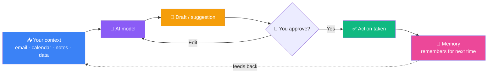

# Awesome Everyday AI

**A Curated, Honest Field Guide to AI Tools That Actually Improve Daily Life**

A no-hype list of AI tools that replace *real recurring chores* — layered for everyday users and builders alike — plus an honest map of the gaps **nobody has solved yet**.

   

| | |
|---|---|
| **What this is** | A curated list of AI tools that replace real everyday chores — with the *recipe*, not just the link |
| **Who it's for** | 🟢 Everyday users (no code) **and** 🔧 builders (wire it yourself) |
| **Covers** | Productivity & Time · Home & Finance · Learning & Creativity · Health & Wellness |
| **The twist** | A whole section on what AI *still can't do well* in 2026 — the openings worth building |
| **Last reviewed** | May 2026 |
| **License** | [CC0-1.0](LICENSE) — copy, adapt, and remix freely |

---

## How to read this list

| Tag | Meaning |
|---|---|
| 🟢 | No code needed — anyone can use it today |
| 🔧 | Builder / self-host option available |
| 🆕 | Shipped or majorly upgraded in the last ~6 months |
| 💸 | Paid / subscription |
| 🔒 | Strong privacy / local option |

<b>📑 Table of Contents</b>

- [🧭 Find your tool fast](#-find-your-tool-fast) — *jump straight to what you need*
- [💡 Start here: the one idea](#start-here-the-one-idea-that-changes-everything) — *the mindset shift + the loop behind every tool*
- **By life area**
  - [🗓 Productivity & Time](#-productivity--time) — *email, calendar, notes, scheduling*
  - [🏠 Home & Finance](#-home--finance) — *budgeting, price tracking, errands*
  - [📚 Learning & Creativity](#-learning--creativity) — *tutoring, research, writing, media*
  - [💪 Health & Wellness](#-health--wellness) — *fitness, sleep, coaching*
- [🚀 The Frontier](#-the-frontier-what-doesnt-exist-well-yet) — *what AI still can't do well in 2026*
- [🔒 Privacy-First & Local](#-privacy-first--local) — *keep your life off the cloud*
- [🗂 Full Tool Index](#-full-tool-index) — *every tool, alphabetical, at a glance*
- [⭐ What makes this list different](#what-makes-this-list-different)
- [🤝 Contributing](#contributing)

---

## 🧭 Find your tool fast

| If you want to… | Go to | Best starting pick |
|---|---|---|
| 📥 Tame your inbox & calendar | [Productivity & Time](#-productivity--time) | Gemini Spark / Reclaim |
| 💰 Track prices & budget smarter | [Home & Finance](#-home--finance) | Information Agents + YNAB |
| 🎓 Learn or research something | [Learning & Creativity](#-learning--creativity) | NotebookLM |
| 😴 Improve sleep & fitness | [Health & Wellness](#-health--wellness) | WHOOP Coach |
| 🔐 Keep your data private | [Privacy-First & Local](#-privacy-first--local) | LM Studio (no code) / Ollama |
| 🛠 Build something new | [The Frontier](#-the-frontier-what-doesnt-exist-well-yet) | Pick a gap, ship a demo |

---

## Start here: the one idea that changes everything

The single biggest mistake is treating AI like a search box. The shift that changes everything: **stop asking it questions, start handing it jobs.**

Every tool below — and every tool worth building — is really just one loop:

Three principles for picking tools that stick:

| Principle | Bad | Good |
|---|---|---|
| **Reactive → Proactive** | Waits for you to open it | Runs in the background and pings *you* |
| **One-shot → Persistent** | Forgets you every session | Remembers your context across time |
| **Ten tools → One routine** | A drawer of half-used apps | One annoying chore, fully automated |

🔧 **For builders:** the architecture is always *context in → model → action out*. Start with one tool call (read calendar, search email), pipe it into a model with a clear instruction, return a draft you approve. Everything else is just scaling that loop.

<a href="#awesome-everyday-ai">▲ back to top</a>

---

## 🗓 Productivity & Time

> Email, calendar, notes, and the daily grind of scheduling.

| Tool | What it is | How to use it (everyday) |
|---|---|---|
| **[ChatGPT](https://chatgpt.com)** 🟢🆕 | General assistant; now folds in agentic web tasks (the old "Operator") | Delegate multi-step chores — fill a form, follow a booking flow, compare options across tabs |
| **[Gemini Spark + Daily Brief](https://gemini.google.com)** 🟢🆕💸 | Personal agent wired into Gmail/Docs/Calendar; produces a morning digest | Auto-summarize newsletters, surface today's conflicts, draft replies *(gated behind the Ultra plan)* |
| **[Claude](https://claude.ai)** 🟢 | Strong reasoning + writing assistant | Long-document summaries, drafting, "think through this decision with me" |
| **[Reclaim](https://reclaim.ai)** 🟢 | AI calendar defragmenter | Auto-schedules focus blocks, habits, and buffers around meetings |
| **[Otter](https://otter.ai)** 🟢 | Meeting capture + searchable transcripts | Stop taking notes; later search "what did we decide about X" |
| **[Notion AI](https://notion.so)** 🟢💸 | Notes/docs with built-in AI | Turn messy notes into a structured doc; auto-generate task lists |

> **🍳 Recipe — morning triage in 5 minutes**
> Each morning, have your assistant read overnight email + today's calendar and produce: *3 things that need a reply, 2 schedule conflicts, 1 thing you're forgetting.* Approve the drafted replies. Done.

🔧 **For builders:** A "Daily Brief" clone is the best first project. Pull calendar events + recent unread email, feed them to a model with a fixed prompt template, and post the summary to yourself (email, Slack, or push notification). ~100 lines.

<a href="#awesome-everyday-ai">▲ back to top</a>

---

## 🏠 Home & Finance

> Budgeting, price tracking, errands, and household ops.

| Tool | What it is | How to use it (everyday) |
|---|---|---|
| **[Google Information Agents](https://gemini.google.com)** 🟢🆕💸 | Background 24/7 monitors — Google Alerts, upgraded | Price-drop watches, "tell me when this restocks," weather/market alerts that ping you |
| **[YNAB](https://ynab.com)** 🟢💸 | Zero-based budgeting with AI categorization | Auto-categorize spending; ask "can I afford this?" against real rules |
| **[Kayak](https://kayak.com) · [Hopper](https://hopper.com) · [Expedia](https://expedia.com)** 🟢 | Trip planning + price prediction | "Plan a 4-day trip under $X"; get told *when* to book, not just the price |
| **ChatGPT / Claude + receipts** 🟢 | Vision + reasoning on your own data | Photograph receipts/bills → get a categorized spend summary you paste into a sheet |

> **🍳 Recipe — the "should I buy it?" agent**
> Set a background monitor on the 5 things on your wishlist. When one drops below your target price *and* fits this month's budget, you get one notification with a buy/skip call. No more manual price-checking.

🔧 **For builders:** Price monitoring is a clean agent project — a scheduled job that checks a price, compares to a threshold, and pings you only on the trigger. The genuinely *unsolved* part is wiring it to your actual budget (see [the Frontier](#-the-frontier-what-doesnt-exist-well-yet)).

<a href="#awesome-everyday-ai">▲ back to top</a>

---

## 📚 Learning & Creativity

> Tutoring, research, writing, and making things.

| Tool | What it is | How to use it (everyday) |
|---|---|---|
| **[NotebookLM](https://notebooklm.google.com)** 🟢🆕 | Grounds answers in *your* uploaded sources; makes audio overviews | Drop in a textbook/PDFs → ask questions answered only from those sources; turn them into a podcast for your commute |
| **[Perplexity](https://perplexity.ai)** 🟢 | Answer engine with citations | Research with sources you can actually click and verify |
| **[Khanmigo](https://khanmigo.org)** 🟢💸 | AI tutor that guides instead of answering | Socratic homework help; won't just hand over the solution |
| **Claude / ChatGPT** 🟢 | Writing + thinking partner | Draft, edit, get feedback; "explain this like I know X but not Y" |
| **[Midjourney](https://midjourney.com) · Sora · [Runway](https://runwayml.com)** 🟢💸 | Generative image/video | Personal projects, mockups, learning visualizations |

> **🍳 Recipe — learn anything from sources you trust**
> Put the real material (course PDFs, docs, a book) into NotebookLM so answers are *grounded* and won't hallucinate, then generate an audio overview to review hands-free. Use Perplexity only for the "find me good sources" step.

🔧 **For builders:** This is RAG (retrieval-augmented generation). The everyday-useful version: a folder of your own notes + a local embedding model so it's private and free. See [Privacy-First & Local](#-privacy-first--local).

<a href="#awesome-everyday-ai">▲ back to top</a>

---

## 💪 Health & Wellness

> Fitness, sleep, and coaching. *(None of these are medical advice — they're pattern-spotters.)*

| Tool | What it is | How to use it (everyday) |
|---|---|---|
| **[WHOOP Coach](https://whoop.com)** 🟢🆕💸 | Wearable + conversational coach | "Why am I tired today?" → answers from your own recovery/sleep data |
| **[Garmin Connect AI](https://garmin.com)** 🟢🆕 | Training-load analysis | Adjusts workout suggestions to your actual readiness |
| **[Fitbit AI](https://fitbit.com)** 🟢🆕 | Sleep/activity insights | Plain-language "here's what changed this week" summaries |
| **ChatGPT / Claude as a logger** 🟢 | Reasoning over data you paste | Paste a week of sleep/workout numbers → ask for patterns and one change to try |

> **🍳 Recipe — one change a week**
> Sunday night, sync or paste your week's sleep + activity and ask for *exactly one* adjustment to try. Constraining it to one change is what makes it stick.

<a href="#awesome-everyday-ai">▲ back to top</a>

---

## 🚀 The Frontier: what doesn't exist (well) yet

> The most valuable section. These gaps are wide open — showcasing or building into them is where the interesting work is.

| # | The Gap | Why it's still unsolved | The Opportunity |
|---|---------|------------------------|-----------------|
| 1 | **Durable cross-device memory** | Assistants feel *episodic* — they forget you across devices and time | A personal memory layer **you own** and plug into any model |
| 2 | **Self-expiring facts** | Memory goes stale (old job, old address) and tools rarely notice | Knowing *what to forget* — an open research problem |
| 3 | **Truly proactive life-ops** | Pieces exist (calendar, flight status, email); the *glue* doesn't | "Your flight moved → it conflicts → here's the fix," acted on before you ask |
| 4 | **Budget-aware purchasing** | Price trackers and budget apps don't talk to each other | Connect "this dropped in price" to "and you can afford it this month" |
| 5 | **Private-by-default everything** | Mainstream tools ship your data to the cloud, unauditable | A genuinely local, auditable personal assistant |
| 6 | **Nuance & emotional read** | Tools still miss tone and context humans catch instantly | Anything coaching- or relationship-adjacent is wide open |

🔧 **Each of these is a buildable demo.** A repo that *shows* even a rough version of #1 or #4 stands out far more than another link list.

<a href="#awesome-everyday-ai">▲ back to top</a>

---

## 🔒 Privacy-First & Local

> For when you don't want your life shipped to someone else's cloud.

| Tool | What it is | How to use it |
|---|---|---|
| **[Ollama](https://ollama.com)** 🔧🔒 | Run open models locally with one command | `ollama run llama3` — a capable assistant that never leaves your machine |
| **[LM Studio](https://lmstudio.ai)** 🟢🔒 | Desktop app for local models, no terminal | Point-and-click private chat; great entry point for non-coders |
| **On-device embeddings (FastEmbed)** 🔧🔒 | Local vector search, no API calls | Private RAG over your own notes — the whole pipeline stays on-device |

🔧 **For builders:** Ollama + a local embedding model + your notes folder = a private "second brain" that answers from your own documents with zero data egress. The highest-leverage weekend project on this whole list.

<a href="#awesome-everyday-ai">▲ back to top</a>

---

## 🗂 Full Tool Index

> Every tool in one place — alphabetical, so you can scan tags at a glance. `↗` jumps to the section.

`📊 23 tools · 4 life areas · 4 builder starter projects · 6 frontier gaps · last reviewed May 2026`

| Tool | Category | Tags | Section |
|---|---|---|---|
| [ChatGPT](https://chatgpt.com) | Productivity · Learning | 🟢 🆕 | [↗](#-productivity--time) |
| [Claude](https://claude.ai) | Productivity · Learning | 🟢 | [↗](#-productivity--time) |
| [Expedia](https://expedia.com) | Home & Finance | 🟢 | [↗](#-home--finance) |
| FastEmbed (on-device embeddings) | Privacy / Local | 🔧 🔒 | [↗](#-privacy-first--local) |
| [Fitbit AI](https://fitbit.com) | Health & Wellness | 🟢 🆕 | [↗](#-health--wellness) |
| [Garmin Connect AI](https://garmin.com) | Health & Wellness | 🟢 🆕 | [↗](#-health--wellness) |
| [Gemini Spark + Daily Brief](https://gemini.google.com) | Productivity | 🟢 🆕 💸 | [↗](#-productivity--time) |
| [Google Information Agents](https://gemini.google.com) | Home & Finance | 🟢 🆕 💸 | [↗](#-home--finance) |
| [Hopper](https://hopper.com) | Home & Finance | 🟢 | [↗](#-home--finance) |
| [Kayak](https://kayak.com) | Home & Finance | 🟢 | [↗](#-home--finance) |
| [Khanmigo](https://khanmigo.org) | Learning & Creativity | 🟢 💸 | [↗](#-learning--creativity) |
| [LM Studio](https://lmstudio.ai) | Privacy / Local | 🟢 🔒 | [↗](#-privacy-first--local) |
| [Midjourney](https://midjourney.com) | Learning & Creativity | 🟢 💸 | [↗](#-learning--creativity) |
| [NotebookLM](https://notebooklm.google.com) | Learning & Creativity | 🟢 🆕 | [↗](#-learning--creativity) |
| [Notion AI](https://notion.so) | Productivity | 🟢 💸 | [↗](#-productivity--time) |
| [Ollama](https://ollama.com) | Privacy / Local | 🔧 🔒 | [↗](#-privacy-first--local) |
| [Otter](https://otter.ai) | Productivity | 🟢 | [↗](#-productivity--time) |
| [Perplexity](https://perplexity.ai) | Learning & Creativity | 🟢 | [↗](#-learning--creativity) |
| [Reclaim](https://reclaim.ai) | Productivity | 🟢 | [↗](#-productivity--time) |
| [Runway](https://runwayml.com) | Learning & Creativity | 🟢 💸 | [↗](#-learning--creativity) |
| Sora | Learning & Creativity | 🟢 💸 | [↗](#-learning--creativity) |
| [WHOOP Coach](https://whoop.com) | Health & Wellness | 🟢 🆕 💸 | [↗](#-health--wellness) |
| [YNAB](https://ynab.com) | Home & Finance | 🟢 💸 | [↗](#-home--finance) |

<a href="#awesome-everyday-ai">▲ back to top</a>

---

## What makes this list different

1. **Layered for everyone.** Plain-language "how to use it" for everyday users, plus 🔧 builder notes for people who want to wire it up themselves — same list, two depths.

2. **Honest about the frontier.** Most lists only show what exists. This one maps the gaps AI *still can't fill* in 2026 — the most useful part for anyone deciding what to build or wait for.

3. **Recipes, not link dumps.** Every section ends with a concrete routine. The point isn't the tool — it's the chore it deletes.

4. **No hype, no affiliates.** Official links only. Cost and gating are tagged honestly (💸). If a tool is locked behind a pricey plan, the list says so.

5. **Privacy is a first-class citizen.** A dedicated 🔒 section for local, self-hosted, auditable options — not an afterthought.

---

**Maintained by** [@ProjectWaja](https://github.com/ProjectWaja) · Contributions welcome — see [CONTRIBUTING.md](CONTRIBUTING.md)

**License:** [CC0-1.0](LICENSE) — public domain. Copy, adapt, and share freely.
